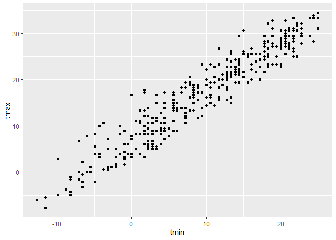
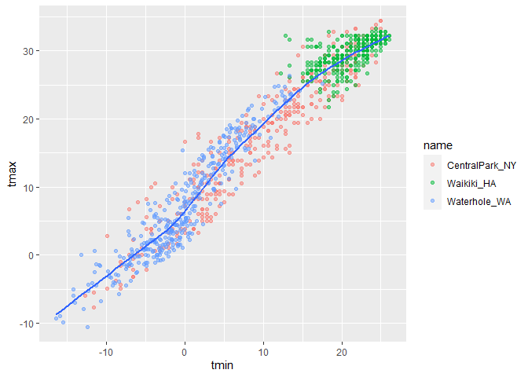
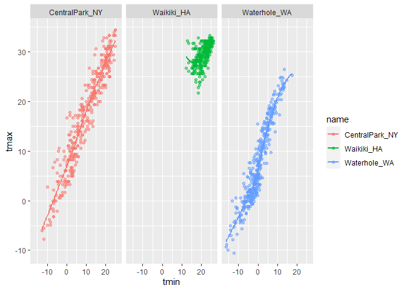
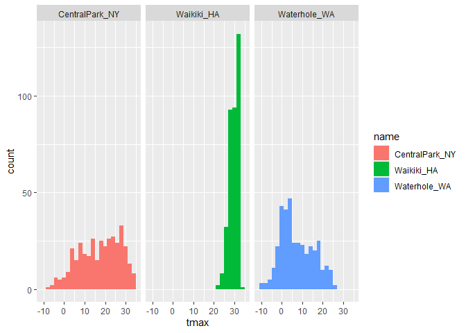
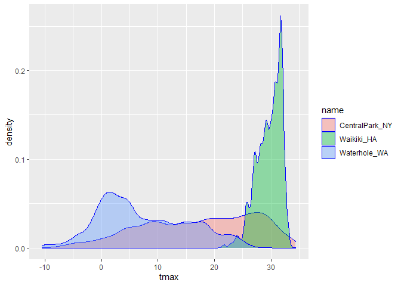
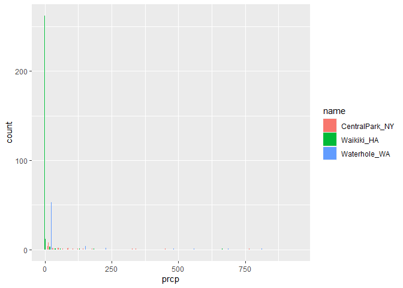
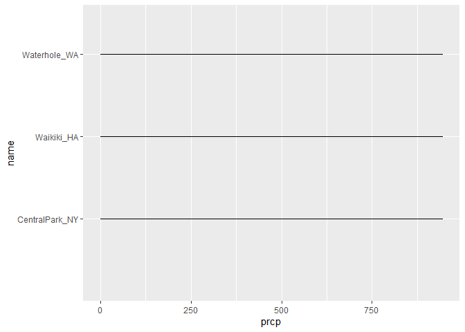
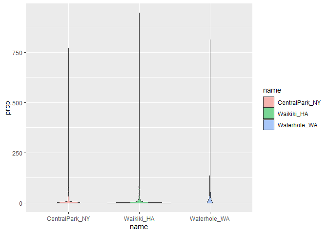

Data_Visualization
================
William Anderson
2022-09-29

We’ll be working with NOAA weather data, which is downloaded using
rnoaa::meteo_pull_monitors function in the code chunk below; similar
code underlies the weather dataset used elsewhere in the course. Because
this process can take some time, I’ll cache the code chunk.

    ## # A tibble: 1,095 × 6
    ##    name           id          date        prcp  tmax  tmin
    ##    <chr>          <chr>       <date>     <dbl> <dbl> <dbl>
    ##  1 CentralPark_NY USW00094728 2017-01-01     0   8.9   4.4
    ##  2 CentralPark_NY USW00094728 2017-01-02    53   5     2.8
    ##  3 CentralPark_NY USW00094728 2017-01-03   147   6.1   3.9
    ##  4 CentralPark_NY USW00094728 2017-01-04     0  11.1   1.1
    ##  5 CentralPark_NY USW00094728 2017-01-05     0   1.1  -2.7
    ##  6 CentralPark_NY USW00094728 2017-01-06    13   0.6  -3.8
    ##  7 CentralPark_NY USW00094728 2017-01-07    81  -3.2  -6.6
    ##  8 CentralPark_NY USW00094728 2017-01-08     0  -3.8  -8.8
    ##  9 CentralPark_NY USW00094728 2017-01-09     0  -4.9  -9.9
    ## 10 CentralPark_NY USW00094728 2017-01-10     0   7.8  -6  
    ## # … with 1,085 more rows

We’ll start with a basic scatterplot to develop our understanding of
ggplot’s data + mappings + geoms approach, and build quickly from there.

## Basic scatterplot

``` r
ggplot(weather_df, aes(x = tmin, y = tmax)) + geom_point()
```

<!-- -->

The code below could be used instead to produce the same figure. Using
this style can be helpful if you want to do some pre-processing before
making your plot but don’t want to save the intermediate data.

drop_na removes na values

``` r
weather_df %>% 
  
  drop_na() %>%
  
  filter(name == "CentralPark_NY") %>%
  
  ggplot(aes(x = tmin, y = tmax)) + 
  
  geom_point()
```

<!-- -->

Notice that we try to use good styling practices here as well – new plot
elements are added on new lines, code that’s part of the same sequence
is indented, we’re making use of whitespace, etc.

You can also save the output of ggplot() to an object and modify / print
it later. This is often helpful, although it’s not my default approach
to making plots.

``` r
plot_weather = 
  weather_df %>%
  ggplot(aes(x = tmin, y = tmax))

plot_weather + geom_point()
```

<!-- -->

## Advanced scatterplots

The basic scatterplot gave some useful information – the variables are
related roughly as we’d expect, and there aren’t any obvious outliers to
investigate before moving on. We do, however, have other variables to
learn about using additional aesthetic mappings.

Let’s start with name, which I can incorporate using the color
aesthetic:

``` r
ggplot(weather_df, aes(x = tmin, y = tmax)) + 
  
  geom_point(aes(color = name))
```

<!-- -->

next I’ll add a smooth curve and make the data points a bit transparent.
Alpha makes points more or less transparent, goes from 0-1 where 0 is
not transparent, 1 is completely

``` r
ggplot(weather_df, aes(x = tmin, y = tmax)) + 
  geom_point(aes(color = name), alpha = 0.5) + 
  geom_smooth(se = FALSE)
```

<!-- -->

The X and Y mappings apply to the whole graphic, but color is currently
geom-specific. Sometimes you want or need to do this, but for now I
don’t like it. If I’m honest, I’m also having a hard time seeing
everything on one plot, so I’m going to add facet based on name as well.

``` r
ggplot(weather_df, aes(x = tmin, y = tmax, color = name)) + 
  geom_point(alpha = 0.5) + 
  geom_smooth(se = FALSE) + 
  facet_grid(. ~ name)
```

<!-- -->

This splits up the three datsets into their own individual scatterplots

However, the relationship between minimum and maximum temperature is now
kinda boring, so I’d prefer something that shows the time of year. Also
I want to learn about precipitation, so let’s do that.

``` r
ggplot(weather_df, aes(x = date, y = tmax, color = name)) + 
  geom_point(aes(size = prcp), alpha = 0.5) + 
  geom_smooth(se = FALSE) + 
  facet_grid(. ~ name) 
```

<!-- -->

Write a code chain that starts with weather_df; focuses only on Central
Park, converts temperatures to Fahrenheit, makes a scatterplot of min
vs. max temperature, and overlays a linear regression line (using
options in geom_smooth())

``` r
weather_df %>%
  
  filter(name == "CentralPark_NY") %>%
  mutate(
    tmin_fahr = tmin * (9/5) + 32,
    tmax_fahr = tmax * (9/5) + 32) %>%
  
  ggplot(aes(x = tmin_fahr, y = tmax_fahr)) + 
  geom_point(alpha = 0.5) + 
  geom_smooth(method = "lm", se = FALSE)
```

<!-- -->

se in geom_smooth displays confidence interval so when false this is
hidden, lm plots a linear line over the scatterplot

## Univariate plots

Scatterplots are great, but sometimes you need to carefully understand
the distribution of single variables

``` r
ggplot(weather_df, aes(x = tmax)) + 
  geom_histogram()
```

<!-- -->

Can change the bind width and set fill color using aesthetics

``` r
ggplot(weather_df, aes(x = tmax, fill = name)) + 
  geom_histogram(position = "dodge", binwidth = 2) + 
  facet_grid(. ~ name)
```

<!-- -->

position = dodge places the bars for ech group side by side

Now we use density plots

``` r
ggplot(weather_df, aes(x = tmax, fill = name)) + 
  geom_density(alpha = 0.4, adjust = 0.5, color = "blue")
```

<!-- -->

The adjust parameter is similar to binwidth parameter, transparency is
set to 0.4 to make sure all densities appear, adding geom_rug() to
density plot can be helpful way to show raw data in addition to density

``` r
ggplot(weather_df, aes(x = name, y = tmax)) + 
  geom_boxplot()
```

<!-- -->

Now we use violin plots

``` r
ggplot(weather_df, aes(x = name, y = tmax)) + 
  geom_violin(aes(fill = name), alpha = 0.5) + 
  stat_summary(fun = "median", color = "blue")
```

<!-- -->

Ridge plots were the trendiest plot of 2017, and were a replacement for
both boxplots and violin plots. They’re implemented in the ggridges
package, and are nice if you have lots of categories in which the shape
of the distribution matters.

``` r
ggplot(weather_df, aes(x = tmax, y = name)) + 
  geom_density_ridges(scale = 0.85)
```

<!-- -->

Make plots that compare precipitation across locations. Try a histogram,
a density plot, a boxplot, a violin plot, and a ridgeplot; use aesthetic
mappings to make your figure readabable

``` r
ggplot(weather_df, aes(x = prcp, fill = name)) + 
  geom_histogram(position = "dodge", binwidth = 2)
```

<!-- -->

``` r
ggplot(weather_df, aes(x = prcp, y = name)) + 
  geom_density(alpha = 0.3)
```

<!-- -->

``` r
ggplot(weather_df, aes(x = name, y = prcp)) + 
  geom_boxplot()
```

<!-- -->

``` r
ggplot(weather_df, aes(x = name, y = prcp)) + 
  geom_violin(aes(fill = name), alpha = 0.5)
```

<!-- -->

## Saving and embedding plots

Don’t use export button, instead use ggsave

``` r
weather_plot = ggplot(weather_df, aes(x = tmin, y = tmax)) + 
  geom_point(aes(color = name), alpha = 0.5)

ggsave("weather_plot.pdf", weather_plot, width = 8, height = 5)
```

Embedding plots in an R Markdown document can also take a while to get
used to, because there are several things to adjust. First is the size
of the figure created by R, which is controlled using two of the three
chunk options fig.width, fig.height, and fig.asp

I prefer a common width and plots that are a little wider than they are
tall, so I set options to fig.width = 6 and fig.asp = .6

Second is the size of the figure inserted into your document, which is
controlled using out.width or out.height. I like to have a little
padding around the sides of my figures, so I set out.width = “90%”. I do
all this by including the following in a code snippet at the outset of
my R Markdown documents.

``` r
knitr::opts_chunk$set(
  fig.width = 6,
  fig.asp = 0.6,
  out.width = "90%"
)
```

What makes embedding figures difficult at first is that things like the
font and point size in the figures generated by R are constant – that
is, they don’t scale with the overall size of the figure. As a result,
text in a figure with width 12 will look smaller than text in a figure
with width 6 after both have been embedded in a document.
